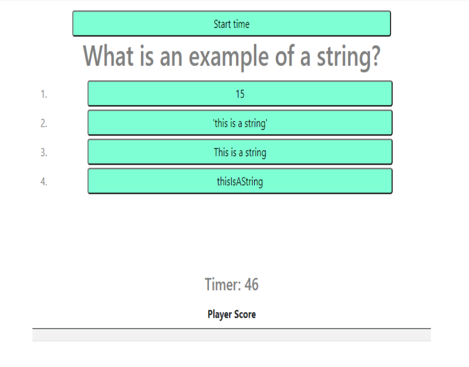

# Code-Quiz
## Description
This project is a short, basic quiz on JavaScript. It was built to practice writing JavaScript as a project assigned by my teachers at Trilogy/USyd and has been a valuable tool in
beginning to understand Javascript syntax and functionality.
The general purpose of the Code Quiz is to answer a short array of general questions on JavaScript. For every incorrect answer, 10 seconds is deducted from your time remaining and the time you are left with at the end is your final score.
I learnt quite a bit about ID selection, the importance of naming everything as specifically as possible, and also keeping your code as simple and easy to follow as you can.
This code is not perfect and I'm not quite satisfied with it's functionality as yet, though I am quite proud of how far I've come. I feel I understand JavaScipt quite a bit more than I did this time last week.

## Application Screenshot

## Usage
Once on the Quiz landing page, pressing "Start Quiz" will take you to the main quiz page where you will be given the option to "Start Time". There are a series of 5 questions with 4 multiple choice answers each. For each incorrect answer, 10 seconds will be deducted from you final time.

## Credits
Written with the advice and support of AskBCS, my teacher David Impey, W3Schools, Stack Overflow, and friends in the coding world.

